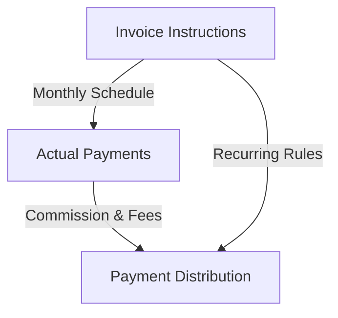

# PayProp Complete Data Architecture Reference
*For Greenfield Development and System Integration*

## 🧪 Based on Real API Testing Results

This document provides the complete PayProp payment data architecture discovered through systematic API testing. Use this as the definitive reference for any PayProp integration development.

---

## 🎯 The Complete PayProp Payment Lifecycle

PayProp operates a **three-stage payment lifecycle** that must be understood and integrated completely:



### Stage 1: Invoice Instructions (What SHOULD Happen)
### Stage 2: Actual Payments (What HAS Happened) 
### Stage 3: Payment Distribution (How It's DISTRIBUTED)

---

## 📋 STAGE 1: Invoice Instructions (`/export/invoices`)

**Purpose:** Recurring payment schedules, rent amounts, tenant assignments

### API Endpoint
```
GET /api/agency/v1.1/export/invoices
Parameters: ?include_categories=true&rows=25
```

### Required Permissions
```
read:export:invoices ✅ Available
```

### Complete Data Structure
```json
{
  "account_type": "direct deposit",
  "category": {
    "id": "Vv2XlY1ema",
    "name": "Rent"
  },
  "debit_order": false,
  "description": "",
  "frequency": "Monthly",
  "frequency_code": "M",
  "from_date": "2025-04-07",
  "gross_amount": 1075,
  "id": "BRXEzNG51O",
  "invoice_type": "Rent",
  "payment_day": 6,
  "property": {
    "address": {
      "city": "Croydon",
      "country_code": "UK",
      "created": "2025-04-07T00:00:00",
      "email": null,
      "fax": null,
      "first_line": "71b Shrubbery Road",
      "id": "7nZ34Y2rJN",
      "latitude": null,
      "longitude": null,
      "modified": "2025-07-01T00:00:00",
      "phone": null,
      "postal_code": "CR0 2RX",
      "second_line": null,
      "state": "Greater London",
      "third_line": null,
      "zip_code": "CR0 2RX"
    },
    "create_date": "2025-04-07T00:00:00",
    "description": "",
    "end_date": "9999-12-31T00:00:00",
    "id": "K3Jwqg8W1E",
    "modify_date": "2025-07-01T00:00:00",
    "name": "71b Shrubbery Road, Croydon",
    "property_image": null,
    "start_date": "2025-04-07T00:00:00"
  },
  "reference": "",
  "tenant": {
    "business_name": "Regan Denise",
    "display_name": "Regan Denise", 
    "email": "tlsjdgzv@me.com",
    "first_name": "Denise",
    "id": "v0Zo3rbbZD",
    "last_name": "Regan"
  },
  "to_date": null,
  "vat": false,
  "vat_amount": 0
}
```

### Critical Fields for Integration
| Field | Purpose | Integration Requirements |
|-------|---------|------------------------|
| `id` | Unique invoice instruction ID | Primary key for linking |
| `gross_amount` | Monthly rent amount | Update property rent amounts |
| `payment_day` | Day of month rent is due | Schedule payment reminders |
| `frequency_code` | Payment frequency (M/Q/A) | Payment scheduling logic |
| `property.id` | PayProp property ID | Link to property entities |
| `tenant.id` | PayProp tenant ID | Link to tenant entities |
| `from_date` | When rent schedule starts | Validity period tracking |
| `category.id` | Invoice category | Payment categorization |

### Business Use Cases
1. **Rent Schedule Management:** Know when rent is due and how much
2. **Property Valuation:** Accurate monthly income for properties
3. **Tenant Management:** Active tenant assignments to properties  
4. **Payment Forecasting:** Predict future cash flows
5. **Variance Detection:** Compare scheduled vs actual payments

---

## 💰 STAGE 2: Actual Payment Transactions (`/report/all-payments`)

**Purpose:** Complete payment records with fees, commissions, and batch information

### API Endpoint  
```
GET /api/agency/v1.1/report/all-payments
Parameters: ?from_date=2025-05-19&to_date=2025-07-18&filter_by=reconciliation_date&rows=25
Rate Limit: 93-day maximum date range
```

### Required Permissions
```
read:report:all-payments ✅ Available
```

### Complete Data Structure
```json
{
  "amount": "15.50",
  "beneficiary": {
    "id": "DWzJBkWXQB", 
    "name": null,
    "type": "agency"
  },
  "category": {
    "id": "Kd71e915Ma",
    "name": "Commission"
  },
  "description": "",
  "due_date": "2025-06-12",
  "has_tax": true,
  "id": "AJ5wQ4pv1M",
  "incoming_transaction": {
    "amount": "126.00",
    "bank_statement": {
      "date": "2025-06-12",
      "id": ""
    },
    "deposit_id": "CDD496",
    "id": "QZG3ePDkZ9",
    "property": {
      "id": "8EJAAwgeJj",
      "name": "Chesterfield Street 57, Flat 8, Romford"
    },
    "reconciliation_date": "2025-06-12",
    "status": "paid",
    "tenant": {
      "id": "D6JmWjbk1v",
      "name": "Andrews Holly"
    },
    "type": "instant bank transfer"
  },
  "part_of_amount": "0.00",
  "payment_batch": {
    "amount": "0.00",
    "id": "",
    "status": "not approved", 
    "transfer_date": "2025-06-12"
  },
  "payment_instruction": {
    "id": "MZnNrqYxZ7"
  },
  "reference": "35914740",
  "secondary_payment": {
    "is_child": false,
    "is_parent": false,
    "parent_payment_id": null
  },
  "service_fee": "0.54",
  "tax_amount": "2.58", 
  "transaction_fee": "0.32"
}
```

### Critical Fields for Integration
| Field | Purpose | Integration Requirements |
|-------|---------|------------------------|
| `id` | Payment transaction ID | Primary key for tracking |
| `amount` | Payment amount (commission/fee) | Financial calculations |
| `incoming_transaction.amount` | Original rent payment | Revenue tracking |
| `incoming_transaction.id` | Source transaction ID | Transaction linking |
| `payment_instruction.id` | Links to invoice instruction | Relates to Stage 1 data |
| `service_fee` | PayProp service charges | Fee accounting |
| `transaction_fee` | Payment processing fees | Cost tracking |
| `tax_amount` | VAT/tax amounts | Tax reporting |
| `payment_batch.id` | Batch processing ID | Batch tracking |
| `reconciliation_date` | When payment was processed | Accounting reconciliation |

### Business Use Cases
1. **Financial Reconciliation:** Match payments to bank statements
2. **Commission Tracking:** Accurate agency commission calculations
3. **Fee Management:** Track all PayProp service fees
4. **Batch Processing:** Group related payments together
5. **Tax Reporting:** Separate tax components for accounting
6. **Payment Status:** Real-time payment processing status

---

## 🏦 STAGE 3: Payment Distribution (`/export/payments`) 

**Purpose:** How payments are distributed to property owners and other beneficiaries

### API Endpoint
```
GET /api/agency/v1.1/export/payments  
Parameters: ?rows=25
```

### Required Permissions
```
read:export:payments ✅ Available
```

### Complete Data Structure
```json
{
  "beneficiary": "Natalie Turner [B]",
  "beneficiary_reference": "53997590", 
  "category": "Owner",
  "category_id": "Vv2XlY1ema",
  "description": "",
  "enabled": true,
  "frequency": "Monthly",
  "frequency_code": "M", 
  "from_date": "2019-02-13",
  "gross_amount": 0,
  "gross_percentage": 100,
  "group_id": null,
  "id": "Kd1b2BGY1v",
  "maintenance_ticket_id": null,
  "no_commission": false,
  "no_commission_amount": 0,
  "payment_day": 0,
  "property": {
    "address": {
      "city": "Canterbury",
      "country_code": "UK",
      "created": "2019-02-07T00:00:00",
      "email": "ituy15yt3@hotmail.co.uk",
      "fax": "1285 215831",
      "first_line": "88a Satchwell Road",
      "id": "90JYeqaPJo",
      "latitude": null,
      "longitude": null,
      "modified": "2019-02-07T00:00:00",
      "phone": "1285 191569",
      "postal_code": "CT1 8WM",
      "second_line": null,
      "state": "Kent",
      "third_line": null,
      "zip_code": "CT1 8WM"
    },
    "create_date": "2019-02-07T00:00:00",
    "description": "",
    "end_date": "9999-12-31T00:00:00",
    "id": "WzJBxGM1QB",
    "modify_date": "2019-02-07T00:00:00",
    "name": "88a Satchwell Road, Canterbury",
    "property_image": null,
    "start_date": "2019-02-07T00:00:00"
  },
  "reference": "",
  "tenant": null,
  "to_date": null,
  "vat": false,
  "vat_amount": 0
}
```

### Critical Fields for Integration
| Field | Purpose | Integration Requirements |
|-------|---------|------------------------|
| `id` | Payment distribution ID | Primary key |
| `beneficiary` | Who receives the payment | Beneficiary management |
| `beneficiary_reference` | Bank/payment reference | Payment processing |
| `category` | Payment type (Owner/Agent/etc) | Payment categorization |
| `gross_percentage` | % of rent to beneficiary | Commission calculations |
| `no_commission` | Exempt from commission | Commission logic |
| `property.id` | Property this applies to | Property linking |
| `frequency_code` | How often payment is made | Payment scheduling |
| `from_date` | When distribution started | Validity tracking |

### Business Use Cases  
1. **Owner Payments:** Automate payments to property owners
2. **Commission Calculations:** Determine agency commission rates  
3. **Beneficiary Management:** Track all payment recipients
4. **Payment Scheduling:** When to distribute payments
5. **Financial Reporting:** Complete payment distribution audit trail

---

## 🔗 Critical Data Linking Patterns

### Primary Relationships
```
Invoice Instructions → Payment Transactions → Payment Distribution
     (Stage 1)      →      (Stage 2)      →      (Stage 3)

Key Linking Fields:
- property.id (common across all stages)
- payment_instruction.id (Stage 2 → Stage 1) 
- category.id (common categorization)
- tenant.id (Stage 1 → Stage 2)
```

### Referential Integrity Requirements
1. **Property ID** must exist across all three stages
2. **Payment Instruction ID** in Stage 2 must link to Stage 1 invoice
3. **Category IDs** must be consistent across stages
4. **Tenant assignments** must match between stages

---

## 📊 Supporting Reference Data

### Invoice Categories (`/invoices/categories`)
```json
{
  "categories": [
    {"id": "woRZQl1mA4", "name": "Deposit", "is_system": false},
    {"id": "6EyJ6RJjbv", "name": "Holding deposit", "is_system": true},
    {"id": "Vv2XlY1ema", "name": "Rent", "is_system": true},
    {"id": "vagXVvX3RP", "name": "Maintenance", "is_system": false},
    {"id": "w7Z4zjlXPN", "name": "Professional Services fee", "is_system": false},
    {"id": "7lwZ73ZDqv", "name": "Rates & Taxes", "is_system": false},
    {"id": "oz2JkGJbgm", "name": "Water & Electricity", "is_system": false}
  ]
}
```

**Integration:** Reference table for payment categorization across all stages.

---

## 🚨 CRITICAL Implementation Requirements

### 1. Data Synchronization Strategy
- **Invoice Instructions:** Sync daily - captures new rent schedules
- **Actual Payments:** Sync hourly - real-time payment processing  
- **Payment Distribution:** Sync weekly - beneficiary rule changes

### 2. Error Handling
- **93-day limit** on all-payments report - chunk date ranges
- **Rate limiting** - implement delays between API calls
- **Missing relationships** - graceful degradation when links break

### 3. Data Validation
- **Amount consistency** across stages
- **Date range validity** for instructions and payments
- **Property/tenant existence** before creating transactions

### 4. Performance Considerations  
- **Pagination** - all endpoints support paging
- **Filtering** - use property_id filters to reduce data volume
- **Caching** - invoice instructions change infrequently

---

## 🎯 Greenfield Development Recommendations

### Database Schema
```sql
-- Stage 1: Invoice Instructions
CREATE TABLE payprop_invoice_instructions (
    id VARCHAR(50) PRIMARY KEY,
    property_id VARCHAR(50) NOT NULL,
    tenant_id VARCHAR(50), 
    gross_amount DECIMAL(10,2) NOT NULL,
    payment_day INTEGER,
    frequency_code VARCHAR(1),
    from_date DATE,
    category_id VARCHAR(50),
    created_at TIMESTAMP DEFAULT CURRENT_TIMESTAMP
);

-- Stage 2: Payment Transactions  
CREATE TABLE payprop_payment_transactions (
    id VARCHAR(50) PRIMARY KEY,
    payment_instruction_id VARCHAR(50),
    incoming_transaction_id VARCHAR(50),
    amount DECIMAL(10,2),
    service_fee DECIMAL(10,2),
    transaction_fee DECIMAL(10,2), 
    tax_amount DECIMAL(10,2),
    reconciliation_date DATE,
    batch_id VARCHAR(50),
    created_at TIMESTAMP DEFAULT CURRENT_TIMESTAMP,
    FOREIGN KEY (payment_instruction_id) REFERENCES payprop_invoice_instructions(id)
);

-- Stage 3: Payment Distribution
CREATE TABLE payprop_payment_distributions (
    id VARCHAR(50) PRIMARY KEY,
    property_id VARCHAR(50) NOT NULL,
    beneficiary_name VARCHAR(255),
    beneficiary_reference VARCHAR(100),
    gross_percentage DECIMAL(5,2),
    category VARCHAR(100),
    frequency_code VARCHAR(1),
    from_date DATE,
    created_at TIMESTAMP DEFAULT CURRENT_TIMESTAMP
);
```

### API Integration Service Structure
```java
@Service  
public class PayPropDataSyncService {
    
    // Stage 1: Invoice Instructions
    public void syncInvoiceInstructions() {
        // GET /export/invoices
        // Process recurring payment schedules
        // Update property rent amounts
    }
    
    // Stage 2: Payment Transactions  
    public void syncPaymentTransactions() {
        // GET /report/all-payments (93-day chunks)
        // Process actual payments with fees
        // Link to invoice instructions
    }
    
    // Stage 3: Payment Distribution
    public void syncPaymentDistribution() {
        // GET /export/payments  
        // Process beneficiary rules
        // Calculate commission structures
    }
}
```

This complete reference provides everything needed for a comprehensive PayProp integration that captures the full payment lifecycle.