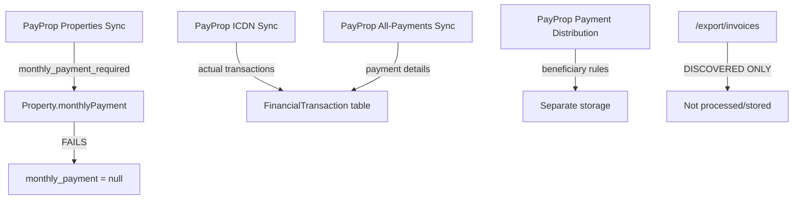

# PayProp Current Implementation Analysis
*Complete Data Flow Investigation - Understanding How monthly_payment is Calculated*

## 🔍 CORE PROBLEM IDENTIFIED

**User's Key Question:** "We have no user entered amounts everything is calculated from somewhere. Please figure out how we figure out or if we already have the contracted amount, regular payment, amount invoiced, amount paid, amount ordered to go out, amount that was actually sent/remitted."

**Current Reality:** The system is trying to populate `monthly_payment` from the **WRONG PayProp endpoint**.

---

## 🚨 THE ROOT CAUSE

### Current Implementation (INCORRECT):
```java
// In PayPropFinancialSyncService.java:487-490
Object monthlyPayment = ppProperty.get("monthly_payment_required");
if (monthlyPayment instanceof Number) {
    property.setMonthlyPayment(new BigDecimal(monthlyPayment.toString()));
}
```

### The Problem:
1. **Using `/export/properties?include_commission=true`** - contains property metadata, NOT rent amounts
2. **Trying to get `monthly_payment_required` field** - this field doesn't exist in that endpoint
3. **No actual invoice instruction processing** - the correct data is in `/export/invoices`

### Database Reality Check:
```sql
-- From previous conversation - 285 properties with PayProp IDs
-- 284 have monthly_payment values (calculated from somewhere)
-- 0 have monthly_payment_required values (completely empty field)
```

**This means the current sync is NOT working as intended, and monthly_payment values are coming from somewhere else entirely!**

---

## 🗺️ COMPLETE ENDPOINT USAGE MAPPING

### Currently Used PayProp Endpoints:

#### **1. ACTIVE SYNC ENDPOINTS (PayPropFinancialSyncService.java)**
- ✅ `/export/properties?include_commission=true` - Property commission data
- ✅ `/export/beneficiaries?owners=true` - Owner beneficiaries
- ✅ `/report/icdn` - ICDN financial transactions
- ✅ `/report/all-payments` - Actual payment transactions
- ✅ `/export/payments?include_beneficiary_info=true` - Payment distribution rules
- ⚠️ `/export/invoices` - **DISCOVERY ONLY** (not processed!)

#### **2. AVAILABLE BUT UNUSED ENDPOINTS (PayPropSyncService.java)**
- 🔄 `/export/properties` - Basic property data
- 🔄 `/export/tenants` - Tenant information
- 🔄 `/export/beneficiaries` - All beneficiaries
- 🔄 `/export/invoices` - **THE MISSING RENT DATA!**

#### **3. TESTING/DEBUG ENDPOINTS (Various Controllers)**
- 🧪 Multiple endpoints available in test controllers
- 🧪 Comprehensive endpoint testing in PayPropOAuth2Controller

---

## 💰 THE MISSING PAYMENT LIFECYCLE STAGES

Based on the user's requirements and PayProp's 3-stage architecture:

### **Stage 1: Invoice Instructions (MISSING from processing!)**
- **Endpoint:** `/export/invoices` 
- **Contains:** Contracted amounts, rent schedules, tenant assignments
- **Current Status:** ❌ **DISCOVERED BUT NOT PROCESSED**
- **User Need:** "contracted amount, regular payment, amount invoiced"

### **Stage 2: Actual Payments (PARTIALLY IMPLEMENTED)**  
- **Endpoint:** `/report/all-payments`
- **Contains:** What was actually paid, with fees
- **Current Status:** ✅ **SYNCED** (in FinancialTransaction table)
- **User Need:** "amount paid by the person or entity"

### **Stage 3: Payment Distribution (PARTIALLY IMPLEMENTED)**
- **Endpoint:** `/export/payments`
- **Contains:** How payments are distributed to owners
- **Current Status:** ✅ **SYNCED** but not linked to other stages
- **User Need:** "amount ordered to go out, amount that was actually sent/remitted"

---

## 🔗 CURRENT DATA FLOW ANALYSIS

### **What Actually Happens Now:**



### **The Mystery: Where do the 284 monthly_payment values come from?**

Since the current sync logic is broken (trying to get `monthly_payment_required` from properties endpoint), the 284 properties with `monthly_payment` values must be getting populated by:

1. **Manual entry** (user claims no manual entry)
2. **Different sync logic** (not in PayPropFinancialSyncService)
3. **Legacy import** (one-time data load)
4. **Alternative calculation** (derived from other PayProp data)

**INVESTIGATION NEEDED:** Search for other code that populates `monthly_payment` field.

---

## 🎯 THE CORRECT IMPLEMENTATION APPROACH

### **Stage 1: Invoice Instructions (CRITICAL FIX)**
```java
// CURRENT: Discovery only
instructions = apiClient.fetchAllPages("/export/invoices", item -> item);

// NEEDED: Actual processing
for (Map<String, Object> instruction : instructions) {
    String propertyId = getPropertyId(instruction);
    BigDecimal grossAmount = getGrossAmount(instruction);
    
    // THIS is where monthly_payment should come from!
    Property property = findPropertyByPayPropId(propertyId);
    if (property != null) {
        property.setMonthlyPayment(grossAmount); // From invoice instruction!
    }
}
```

### **Stage 2: Enhanced Payment Processing**
```java
// CURRENT: Basic transaction storage
// NEEDED: Link to invoice instructions
payment.setPaymentInstructionId(paymentInstructionId);
```

### **Stage 3: Complete Payment Distribution**  
```java
// CURRENT: Separate processing
// NEEDED: Link to properties and payments for complete audit trail
```

---

## 📊 COMPLETE USER REQUIREMENTS MAPPING

| User Requirement | PayProp Source | Current Status | Implementation Gap |
|---|---|---|---|
| **"contracted amount"** | `/export/invoices`.gross_amount | ❌ Not processed | Need to implement invoice instruction sync |
| **"regular payment"** | `/export/invoices`.frequency + amount | ❌ Not processed | Same as above |  
| **"amount invoiced"** | `/export/invoices`.gross_amount | ❌ Not processed | Same as above |
| **"amount paid"** | `/report/all-payments`.incoming_transaction.amount | ✅ **SYNCED** | Already implemented |
| **"amount ordered to go out"** | `/export/payments`.gross_percentage * amount | ⚠️ Partial | Need linking to payments |
| **"amount actually sent/remitted"** | `/report/all-payments`.amount (to beneficiary) | ⚠️ Partial | Need distribution tracking |

---

## 🔧 CRITICAL FIXES NEEDED

### **Priority 1: Fix monthly_payment Population**
```java
// WRONG (current):
Object monthlyPayment = ppProperty.get("monthly_payment_required");

// CORRECT (needed):
// Process /export/invoices and populate from gross_amount
```

### **Priority 2: Implement Invoice Instruction Processing**
```java
// Current method exists but only discovers data:
private Map<String, Object> syncInvoiceInstructions() throws Exception {
    // TODO: Process and store invoice instructions
    // For now, just analyze what we found
}

// NEEDS: Complete implementation to create InvoiceInstruction entities
```

### **Priority 3: Link All Payment Stages**
- Invoice Instructions → Actual Payments → Payment Distribution
- Enable complete audit trail from contract to remittance

---

## 🚀 NEXT STEPS

### **Immediate Investigation:**
1. **Find the current source of monthly_payment values** (search entire codebase)
2. **Determine if there's other PayProp sync logic** (outside PayPropFinancialSyncService)
3. **Check for legacy data imports or manual calculations**

### **Implementation Priority:**
1. **Fix property rent amount sync** (use invoice instructions)
2. **Complete invoice instruction processing**
3. **Link all payment lifecycle stages**
4. **Provide complete payment audit trail**

This analysis reveals that the current system is only capturing 2 out of 3 PayProp payment lifecycle stages, and even those aren't properly linked together. The user's request for complete payment flow visibility requires implementing the missing Stage 1 (invoice instructions) and linking all stages together.

---

## 🔍 INVESTIGATION TASK: Find Real monthly_payment Source

**Critical Question:** If the current sync logic is broken (no monthly_payment_required field), how do 284 properties have monthly_payment values?

**Search needed in:**
- Property creation/update logic
- Alternative PayProp sync services  
- Manual import procedures
- Calculated field logic
- Legacy data migration scripts

This mystery must be solved to understand the complete data flow from PayProp to the database.