# 🔍 PayProp Data Flow Mystery SOLVED
*Complete Investigation Results - How monthly_payment Values Are Actually Populated*

## 🎯 USER'S CORE QUESTION ANSWERED

**User:** "We have no user entered amounts everything is calculated from somewhere. Please figure out how we figure out or if we already have the contracted amount, regular payment, amount invoiced, amount paid, amount ordered to go out, amount that was actually sent/remitted."

**ANSWER:** Your system has **TWO DIFFERENT PayProp sync services** that use **DIFFERENT endpoints and field mappings** - this explains the confusion and data gaps!

---

## 🚨 THE MYSTERY SOLVED: Dual Sync Architecture

### **Service #1: PayPropEntityResolutionService (THE WORKING ONE)**
```java
// File: PayPropEntityResolutionService.java:457-462
Map<String, Object> settings = (Map<String, Object>) data.get("settings");
if (settings != null) {
    Object monthlyPayment = settings.get("monthly_payment");  // ✅ WORKS!
    if (monthlyPayment != null) {
        property.setMonthlyPayment(new BigDecimal(monthlyPayment.toString()));
    }
}
```
- **Endpoint:** `/export/properties` (basic endpoint)
- **Data Source:** `settings.monthly_payment` field  
- **Result:** ✅ **Successfully populates 284 out of 285 properties**

### **Service #2: PayPropFinancialSyncService (THE BROKEN ONE)**
```java
// File: PayPropFinancialSyncService.java:487-490
Object monthlyPayment = ppProperty.get("monthly_payment_required");  // ❌ FAILS!
if (monthlyPayment instanceof Number) {
    property.setMonthlyPayment(new BigDecimal(monthlyPayment.toString()));
}
```
- **Endpoint:** `/export/properties?include_commission=true` (enhanced endpoint)
- **Data Source:** `monthly_payment_required` field (DOESN'T EXIST!)
- **Result:** ❌ **Fails completely - 0 properties populated**

---

## 📊 COMPLETE DATA FLOW ANALYSIS

### **Current Working Data Flow:**

```mermaid
graph TD
    A[PayProp /export/properties] -->|settings.monthly_payment| B[PayPropEntityResolutionService]
    B -->|setMonthlyPayment| C[Property.monthly_payment = £995]
    
    D[PayProp /report/icdn] -->|actual transactions| E[FinancialTransaction table]
    F[PayProp /report/all-payments] -->|payment details| E
    G[PayProp /export/payments] -->|distribution rules| H[Separate processing]
    
    I[PayProp /export/invoices] -->|£1,075 rent instructions| J[DISCOVERED BUT NOT PROCESSED!]
```


### **The Data Source Hierarchy (Current vs Reality):**

| User Requirement | Current Data Source | Actual PayProp Source | Status |
|---|---|---|---|
| **"contracted amount"** | ❌ None | `/export/invoices`.gross_amount (£1,075) | Missing |
| **"regular payment"** | `/export/properties`.settings.monthly_payment (£995) | `/export/invoices`.gross_amount (£1,075) | Incorrect source |
| **"amount invoiced"** | ❌ None | `/export/invoices`.gross_amount (£1,075) | Missing |  
| **"amount paid"** | ✅ `/report/all-payments` | ✅ `/report/all-payments` | ✅ Working |
| **"amount ordered to go out"** | ⚠️ `/export/payments` (unlinked) | `/export/payments` + linking | Partial |
| **"amount actually sent/remitted"** | ⚠️ `/report/all-payments` (unlinked) | `/report/all-payments` + linking | Partial |

---

## 🔧 THE £80 RENT DISCREPANCY EXPLAINED

### **Why Database Shows £995 but PayProp Shows £1,075:**

1. **Database `monthly_payment`** = £995 (from `/export/properties`.settings.monthly_payment)
2. **PayProp Invoice Instructions** = £1,075 (from `/export/invoices`.gross_amount)
3. **The £80 difference** = Settings vs. actual invoiced amounts

**ROOT CAUSE:** Your system is using **property settings** (which may be defaults or old values) instead of **current invoice instructions** (which show what's actually being charged).

---

## 🏗️ COMPLETE PAYROP SYNC SERVICE ARCHITECTURE

### **Service Responsibilities (Current):**

#### **1. PayPropEntityResolutionService** 
- **Purpose:** Basic property/tenant/beneficiary resolution
- **Endpoints:** `/export/properties`, `/export/tenants`, `/export/beneficiaries`
- **Data:** Basic entity data + settings.monthly_payment
- **Status:** ✅ **Working** (populates monthly_payment correctly from settings)

#### **2. PayPropFinancialSyncService**
- **Purpose:** Financial data sync (transactions, payments, distributions)  
- **Endpoints:** `/export/properties?include_commission=true`, `/report/icdn`, `/report/all-payments`, `/export/payments`
- **Data:** Financial transactions, commissions, payment details
- **Status:** ⚠️ **Partially working** (transactions work, property sync broken)

#### **3. PayPropSyncOrchestrator**
- **Purpose:** Coordinates between the above services
- **Status:** ⚠️ **Also has broken monthly_payment logic** (tries monthly_payment_required)

### **The Missing Service:**
#### **4. PayProp Invoice Instructions Sync (NEEDED)**
- **Purpose:** Sync recurring payment schedules and contractual amounts
- **Endpoint:** `/export/invoices`
- **Data:** What SHOULD be paid vs. what IS paid
- **Status:** ❌ **Discovery only, no processing**

---

## 💡 COMPLETE PAYMENT LIFECYCLE MAPPING

### **Stage 1: Contract/Schedule (MISSING from processing)**
- **PayProp Source:** `/export/invoices`
- **Contains:** £1,075 gross_amount, payment_day: 6, frequency: Monthly
- **User Terms:** "contracted amount, regular payment, amount invoiced"
- **Current Status:** ❌ **Discovered but not processed into database**

### **Stage 2: Actual Payments (WORKING)**
- **PayProp Source:** `/report/all-payments` 
- **Contains:** Actual payment amounts, fees, commissions, dates
- **User Terms:** "amount paid by the person or entity"
- **Current Status:** ✅ **Working** (in FinancialTransaction table)

### **Stage 3: Distribution/Remittance (PARTIALLY WORKING)**
- **PayProp Sources:** `/export/payments` + `/report/all-payments`
- **Contains:** How payments are split between owners, agents, fees
- **User Terms:** "amount ordered to go out, amount that was actually sent/remitted"  
- **Current Status:** ⚠️ **Data exists but not properly linked**

---

## 🚀 IMPLEMENTATION RECOMMENDATIONS

### **Priority 1: Fix Property Rent Amount Source (CRITICAL)**
```java
// CURRENT PROBLEM: Two services trying to populate same field differently
// PayPropEntityResolutionService: settings.monthly_payment (£995) ✅ Works
// PayPropFinancialSyncService: monthly_payment_required ❌ Fails

// SOLUTION: Use invoice instructions as authoritative source
// From /export/invoices -> gross_amount (£1,075) 
```

### **Priority 2: Implement Complete Invoice Instructions Sync**
```java
// CURRENT: Discovery only
private Map<String, Object> syncInvoiceInstructions() {
    // TODO: Process and store invoice instructions
    // For now, just analyze what we found
}

// NEEDED: Full processing with entity creation
// Create InvoiceInstruction entities
// Update Property.monthlyPayment from invoice gross_amount
// Link to tenants and categories
```

### **Priority 3: Link All Payment Lifecycle Stages**
```java
// Enable complete audit trail:
// Invoice Instructions -> Actual Payments -> Payment Distribution
// Property rent validation (settings vs. invoices vs. actual)
// Complete payment reconciliation
```

---

## 📋 ANSWER TO USER'S SPECIFIC QUESTIONS

### **"How we figure out or if we already have..."**

| Payment State | How You Currently Get It | How You SHOULD Get It |
|---|---|---|
| **"contracted amount"** | ❌ You don't | `/export/invoices`.gross_amount |
| **"regular payment"** | `/export/properties`.settings.monthly_payment | `/export/invoices`.gross_amount |
| **"amount invoiced"** | ❌ You don't | `/export/invoices`.gross_amount |
| **"amount paid"** | ✅ `/report/all-payments`.incoming_transaction.amount | ✅ Same (working) |
| **"amount ordered to go out"** | `/export/payments`.gross_percentage * amount | ✅ Same (but needs linking) |
| **"amount actually sent/remitted"** | `/report/all-payments`.amount (to beneficiary) | ✅ Same (but needs linking) |

### **"We have no user entered amounts everything is calculated from somewhere"**

**CONFIRMED:** All amounts come from PayProp API endpoints:
- **Property rent:** Currently from `/export/properties`.settings, should be from `/export/invoices`
- **Actual payments:** From `/report/all-payments` ✅
- **Distribution rules:** From `/export/payments` ✅  
- **Commission rates:** From `/export/properties?include_commission=true` ✅

---

## 🎯 NEXT STEPS

### **Immediate Actions:**
1. **Implement complete `/export/invoices` processing** to get true contracted amounts
2. **Update property monthly_payment from invoice instructions** (fixes £80 discrepancy)
3. **Link all payment stages together** for complete audit trail
4. **Reconcile settings.monthly_payment vs. invoice.gross_amount** (identify source of truth)

### **Long-term Architecture:**
1. **Single unified PayProp sync service** instead of fragmented services  
2. **Complete payment lifecycle tracking** from contract to remittance
3. **Real-time payment status monitoring** using webhook capabilities
4. **Automated reconciliation** between expected vs. actual payments

**CONCLUSION:** Your mystery is solved! The system works partially but uses the wrong data sources for rent amounts and doesn't process the complete payment lifecycle. The fix requires implementing the missing Stage 1 (invoice instructions) sync and linking all stages together.