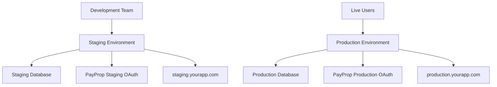

# Production Deployment Strategy
## Maintaining Staging + Production Environments

## Current Situation Analysis
- ✅ **Staging Environment**: Currently running with PayProp data
- ✅ **Data Source**: PayProp via data import page + raw API
- ✅ **Development**: Active development happening in staging
- 🎯 **Goal**: Deploy production while keeping staging for development

## Two-Environment Architecture

### Environment Separation Strategy



## Step 1: Production Environment Setup

### 1.1 Create Production Railway Database
```bash
# Create separate production database
# In Railway Dashboard:
# - New Project → "CRM Production DB"  
# - Environment: production
# - Database: crm_production
```

### 1.2 Create Production Render Service
```yaml
# render-production.yaml
services:
  - type: web
    name: crm-production
    env: java
    plan: professional  # Higher tier for production
    region: ohio
    branch: main  # Production deploys from main branch
    
    buildCommand: mvn clean package -DskipTests -Pproduction
    startCommand: java -jar target/*.jar --spring.profiles.active=production
    
    # Custom domain for production
    customDomains:
      - production.yourapp.com
    
    envVars:
      - key: SPRING_PROFILES_ACTIVE
        value: production
        
      # Production database (new Railway DB)
      - key: SPRING_DATASOURCE_URL
        value: jdbc:mysql://prod-railway-host:6543/crm_production
        
      # PayProp Production OAuth (different from staging)
      - key: PAYPROP_OAUTH_CLIENT_ID
        value: [PRODUCTION_PAYPROP_CLIENT_ID]
        
      # Production logging (less verbose)
      - key: LOGGING_LEVEL_SITE_EASY_TO_BUILD_CRM
        value: INFO
        
      # Production settings
      - key: CRM_DEBUG_MODE
        value: false
        
      - key: SPRING_JPA_HIBERNATE_DDL_AUTO
        value: validate  # Don't recreate tables in prod
```

### 1.3 Environment Configuration Files

#### application-production.properties
```properties
# Production Spring Configuration
spring.profiles.active=production
spring.jpa.hibernate.ddl-auto=validate
spring.sql.init.mode=never
spring.jpa.show-sql=false

# Production database (different from staging)
spring.datasource.url=${SPRING_DATASOURCE_URL}
spring.datasource.username=${SPRING_DATASOURCE_USERNAME}
spring.datasource.password=${SPRING_DATASOURCE_PASSWORD}

# Production PayProp (separate OAuth app)
payprop.oauth.client-id=${PAYPROP_OAUTH_CLIENT_ID}
payprop.oauth.client-secret=${PAYPROP_OAUTH_CLIENT_SECRET}
payprop.oauth.redirect-uri=https://production.yourapp.com/payprop/oauth/callback

# Production Google OAuth
spring.security.oauth2.client.registration.google.redirect-uri=https://production.yourapp.com/login/oauth2/code/google

# Production logging
logging.level.site.easy.to.build.crm=INFO
logging.level.org.springframework.security=WARN

# Production features
crm.debug.mode=false
crm.financial.sync.test-mode=false
management.endpoints.web.exposure.include=health,info
```

## Step 2: Data Migration Strategy

### 2.1 Production Data Population Options

#### Option A: Fresh PayProp Sync (Recommended)
```bash
# 1. Deploy production environment with empty database
# 2. Set up production PayProp OAuth
# 3. Execute production PayProp sync

# Production sync endpoint (no staging prefix)
curl -X POST https://production.yourapp.com/api/payprop/sync/full \
  -H "Authorization: Bearer production-token"
```

#### Option B: Copy Current Staging Data  
```bash
# Export current staging data
mysqldump -h staging-railway-host -P 6543 -u root -p \
  staging_db > production-initial-data.sql

# Import to production database
mysql -h prod-railway-host -P 6543 -u root -p \
  crm_production < production-initial-data.sql
```

### 2.2 Environment Isolation Verification
```bash
# Staging continues to work
curl https://staging.yourapp.com/admin/staging/health

# Production works independently  
curl https://production.yourapp.com/actuator/health
```

## Step 3: Deployment Pipeline Configuration

### 3.1 Branch Strategy
```bash
# Staging Environment (continues as is)
Branch: main or staging  
URL: https://staging.yourapp.com
Auto-deploy: Yes (for development)

# Production Environment (new)
Branch: main (only stable releases)
URL: https://production.yourapp.com  
Auto-deploy: No (manual releases only)
```

### 3.2 Release Process
```bash
# Development workflow:
# 1. Develop in staging environment
git push origin main  # Auto-deploys to staging

# 2. Test in staging with PayProp data
curl https://staging.yourapp.com/admin/staging/health

# 3. When ready for production release
# Manual deploy in Render dashboard:
# Production service → Deploy → Deploy Latest Commit
```

## Step 4: Environment-Specific Controllers

### 4.1 Keep Staging Admin Controller
```java
// StagingDataController.java - remains unchanged
@RestController
@RequestMapping("/admin/staging")
@Profile("staging")  // Only available in staging
public class StagingDataController {
    // All existing staging management endpoints
}
```

### 4.2 Create Production Management Controller
```java
// ProductionManagementController.java - new file
@RestController  
@RequestMapping("/admin/production")
@Profile("production")  // Only available in production
public class ProductionManagementController {
    
    @GetMapping("/health")
    public ResponseEntity<Map<String, Object>> productionHealth() {
        // Production health check (no database reset options)
    }
    
    @GetMapping("/stats") 
    public ResponseEntity<Map<String, Object>> productionStats() {
        // Production statistics (read-only)
    }
    
    // NO database reset endpoint in production
    // NO test user creation in production
}
```

## Step 5: Environment Access Control

### 5.1 Staging Environment (Development Team Only)
```bash
# Staging remains accessible to development team
URL: https://staging.yourapp.com
Access: Development team + test users
Features: 
- Database reset allowed
- Test user creation
- Debug endpoints
- PayProp sync testing
```

### 5.2 Production Environment (Live Users)
```bash
# Production for real users
URL: https://production.yourapp.com  
Access: Real users + property owners
Features:
- No database reset
- No test users
- Limited debug info
- Stable PayProp sync
```

## Step 6: PayProp OAuth Separation

### 6.1 Staging PayProp OAuth (Existing - Keep as is)
```properties
# Staging continues to use existing PayProp app
PAYPROP_OAUTH_CLIENT_ID=staging-client-id-xxxxx
PAYPROP_OAUTH_REDIRECT_URI=https://staging.yourapp.com/payprop/oauth/callback
```

### 6.2 Production PayProp OAuth (New - Required)
```properties
# Create new PayProp OAuth app for production
PAYPROP_OAUTH_CLIENT_ID=production-client-id-xxxxx  
PAYPROP_OAUTH_REDIRECT_URI=https://production.yourapp.com/payprop/oauth/callback
```

**Action Required**: Contact PayProp to create production OAuth application

## Step 7: Monitoring & Maintenance

### 7.1 Dual Environment Monitoring
```bash
# Staging health (development)
curl https://staging.yourapp.com/admin/staging/health

# Production health (live users)  
curl https://production.yourapp.com/actuator/health
```

### 7.2 Data Sync Management
```bash
# Staging: Frequent sync for development data
curl -X POST https://staging.yourapp.com/admin/staging/sync/incremental

# Production: Scheduled sync for live data
# Set up Render cron job or GitHub Action
# Daily sync: curl -X POST https://production.yourapp.com/api/payprop/sync/incremental
```

## Step 8: DNS & Domain Setup

### 8.1 Domain Configuration
```bash
# Production domain
production.yourapp.com → crm-production.onrender.com

# Staging domain (keep existing)  
staging.yourapp.com → crm-staging.onrender.com

# Or use subdomains:
app.yourapp.com → production
staging.yourapp.com → staging
```

## Quick Deployment Checklist

### Prerequisites
- [ ] Create production Railway database  
- [ ] Set up production Render service
- [ ] Configure production PayProp OAuth
- [ ] Set up production domain

### Deployment Steps
1. [ ] Deploy production environment (empty database)
2. [ ] Verify production health endpoint
3. [ ] Set up production PayProp OAuth
4. [ ] Execute production PayProp sync
5. [ ] Verify production data populated correctly
6. [ ] Test production user flows
7. [ ] Update DNS to point production domain
8. [ ] Verify staging still works independently

### Post-Deployment
- [ ] Monitor both environments  
- [ ] Set up production data sync schedule
- [ ] Continue development in staging
- [ ] Release stable features to production

## Cost Implications

### Current Cost (Staging Only)
```
Railway Staging DB: $5/month
Render Staging App: $7/month (Starter)
Total: $12/month
```

### New Cost (Staging + Production)
```
Railway Staging DB: $5/month  
Railway Production DB: $5/month
Render Staging App: $7/month (Starter)
Render Production App: $25/month (Professional)  
Total: $42/month
```

This setup gives you:
- ✅ **Live production** environment for users
- ✅ **Active staging** environment for development  
- ✅ **Independent databases** (no risk to production data)
- ✅ **Separate PayProp** integration (staging/production isolation)
- ✅ **Continuous development** capability while live

Your staging environment continues exactly as it is now, while production runs independently for live users.